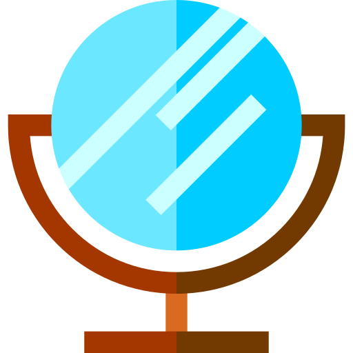

    
    <h3>Myrror - Easy Reflection</h3>

<h2>About the project</h2>

Myrror is a work in a progress for Apple Developer Academy Details Matter Challenge

<h3>Built with</h3>

<h2>License</h2>
Distributed under the MIT License. See `LICENSE.txt` for more information.