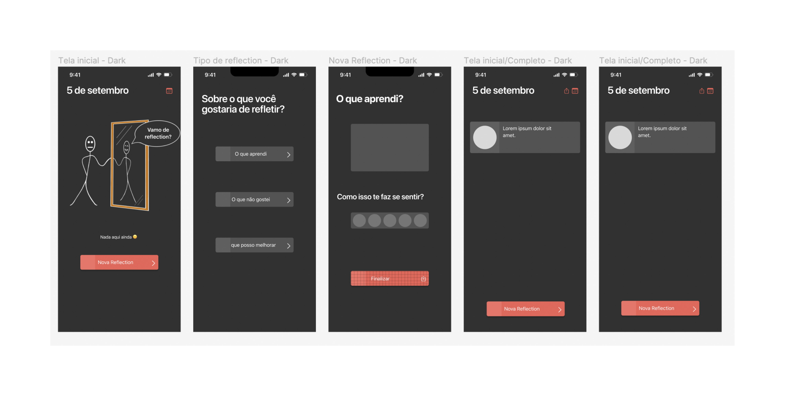

<a name="readme-top"></a>
<div align="center">
    
    <h3>Myrror - Easy Reflection</h3>
</div>

<h2>About the project</h2>
<div align="center">
    
</div>
<p>Myrror is a work in a progress for Apple Developer Academy Details Matter Challenge</p>

<h2>Features</h2>
<ul>
<li>Create Reflections</li>
<li>View reflections from previous days</li>
<li>Share reflections</li>
</ul>

<h3>Built with</h3>


<h2>Contributing</h2>

1. Fork this repositore

2. Create a feature or bug branch

```
git branch feature/[your-feature]
```
3. Commit your changes 🎉

4. Push to the branch

```
git push origin feature/[your-feature]
```
5.📌 Create pull request to laisbastosbg/myrror at branch develop!

<h2>License</h2>
Distributed under the MIT License. See `LICENSE.txt` for more information.
